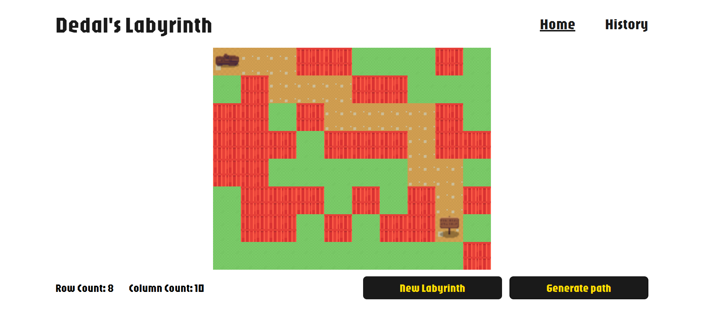

# Dedal's Labyrinth

**Dedal's Labyrinth** is a project I developed during a 24-hour Hackathon organized by the University Politehnica of Bucharest and the Serviciul de Informaţii Externe (SIE). The challenge was to create an application that could generate, visualize, and store labyrinth paths in a database. The solution was built using **React with TypeScript** for the front-end, and **ASP.NET Core 8** with a **MySQL** database for the back-end.

This was my first experience participating in a hackathon, competing as an independent developer against three teams of up to four members. Despite the challenge, I successfully achieved the task and was awarded **second place** in the competition.

### Features of Dedal's Labyrinth:

- **Path Generator**: Generate random labyrinths with visual representations.
- **Shortest Path Finder**: Calculate and display the shortest path within the generated labyrinth.
- **Database Integration**: Store and retrieve labyrinths from the database.

### Requirements:

To run this project, you need:

- **Node.js**: For running the React front-end.
- **Visual Studio**: For handling the ASP.NET Core back-end.
- **MySQL**: For the database to store labyrinth data.

### How to Use:

1. Open `DedalLabyrinth.sln` in **Visual Studio**.
2. Run the project by selecting **Start** or pressing **Ctrl + F5**.
3. The server will open with **Swagger UI** at [https://localhost:7031/swagger/index.html](https://localhost:7031/swagger/index.html).
4. The React app will be available at [https://localhost:5173](https://localhost:5173).

This setup will enable you to explore and test the project, interact with the server API via Swagger, and view the labyrinth paths generated on the front-end interface.
